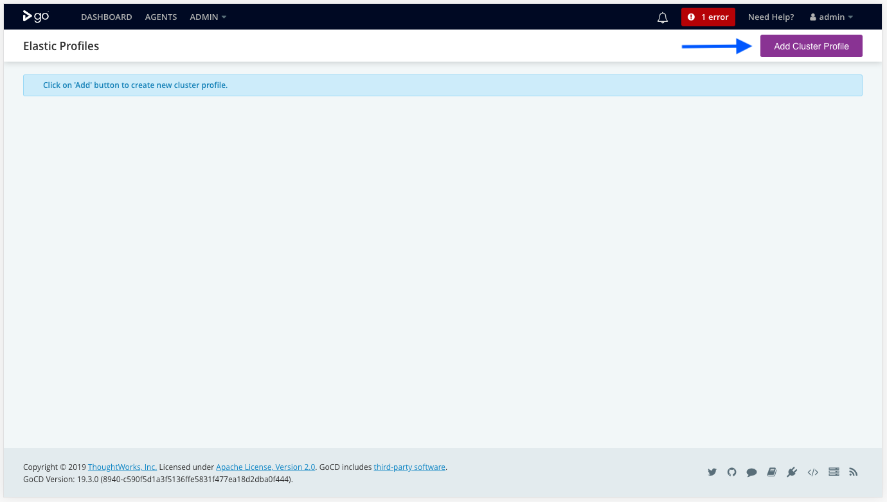
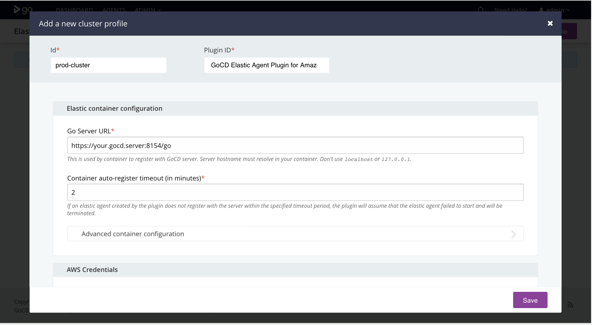
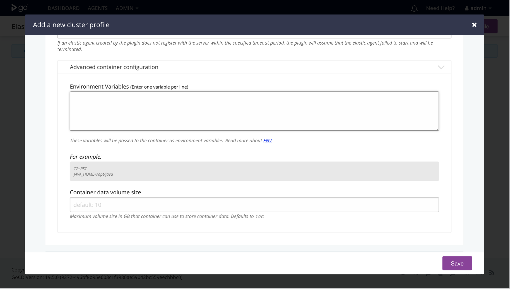
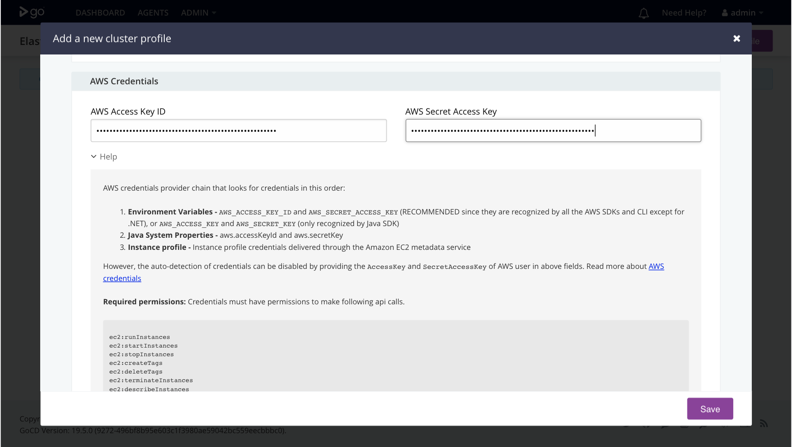
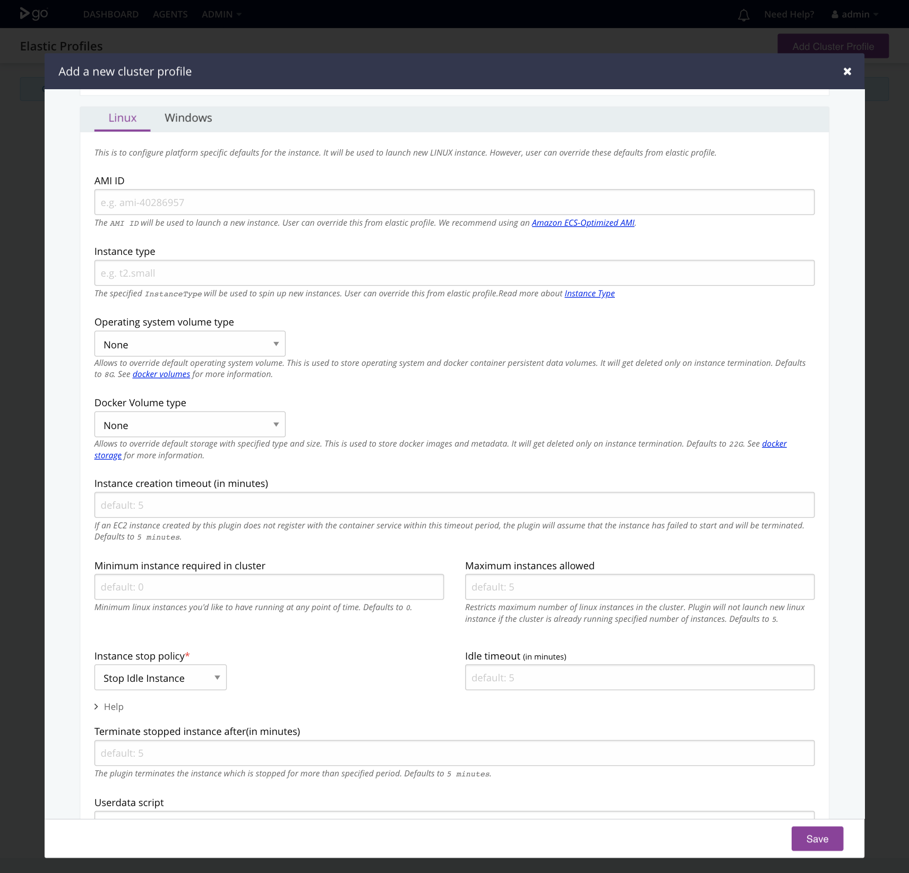
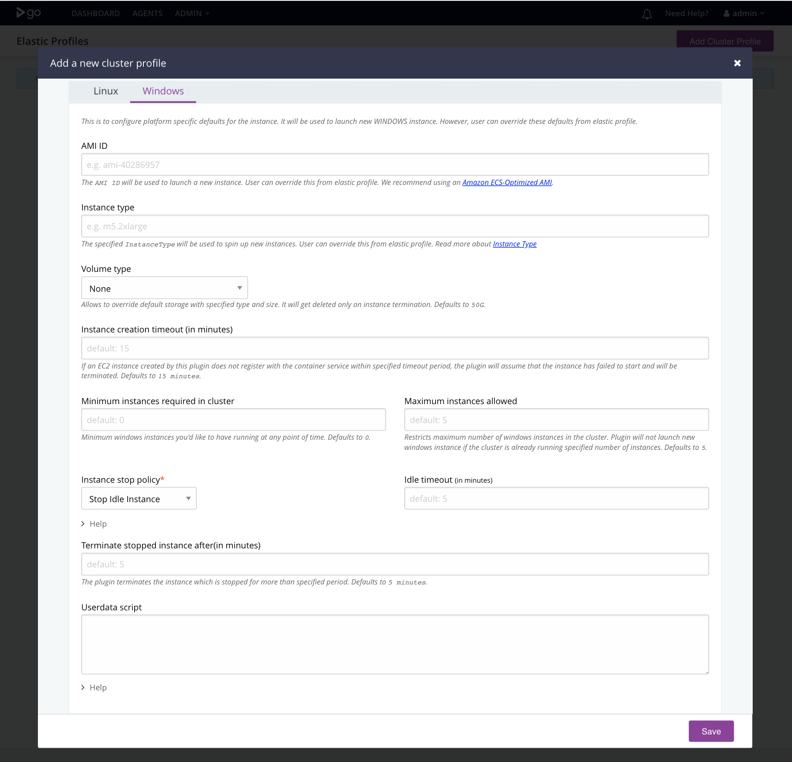
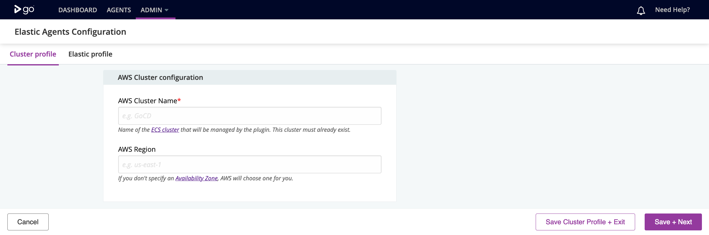
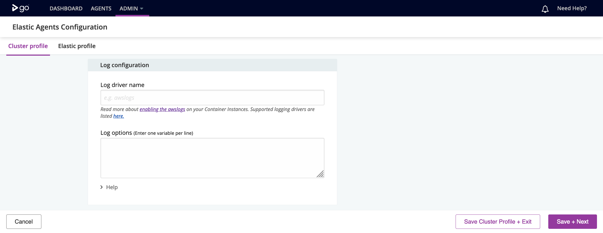
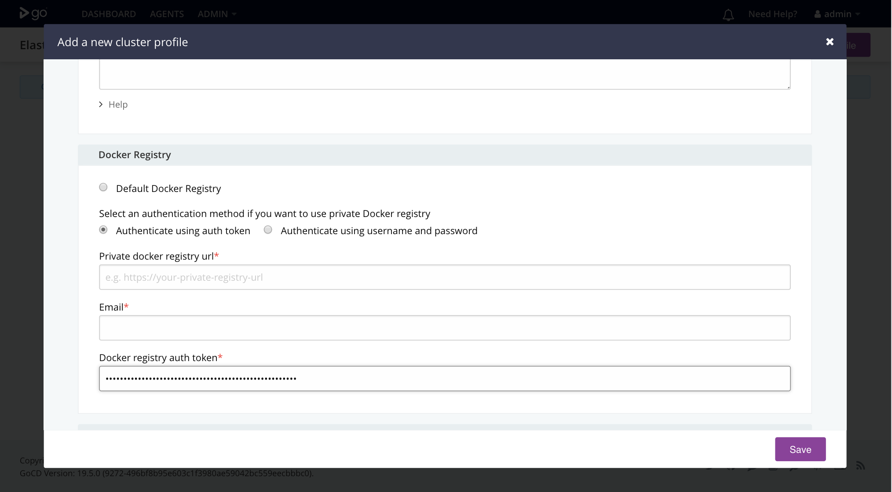
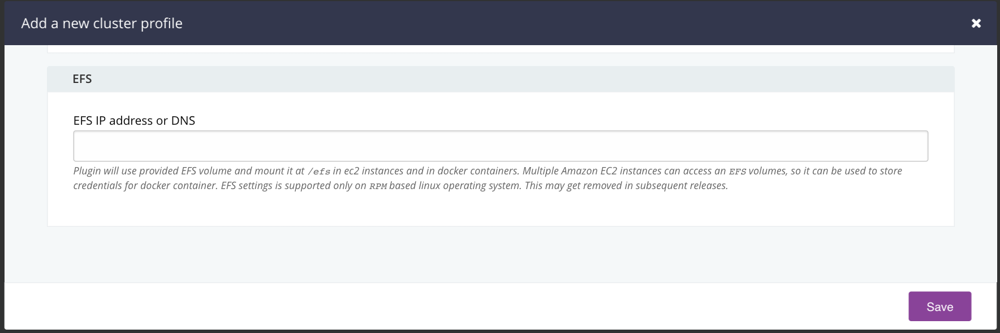

# Configure cluster profile

* Navigate to **_Admin > Elastic Agent Configurations_** in the main menu.
* Click the **_Add_** button to create a new cluster profile.
* Select `GoCD Elastic Agent Plugin for Amazon ECS` value for plugin Id.   




**_Note:_** *Configuration marked with (\*) are mandatory*

## Cluster configuration


 
1. **Cluster Profile Name (mandatory):** Identifier for the newly defined cluster profile. 

2. **GoCD Server URL (mandatory)*:** This is used by container to register with GoCD server. Server hostname must resolve from within your container. Don't use `localhost`.

3. **Container auto-register timeout in minutes (mandatory):** If an agent running on a container created by this plugin does not register with this server within the specified timeout period (specified in minutes), the plugin will assume that the container failed to startup and will terminate it.

## Advanced Container Configuration



1. **Environment Variables:** These variables will be passed onto the container when it is started up. Read more about [docker's ENV](https://docs.docker.com/engine/reference/builder/#env).
   
    For example:
  
    ```text
    TZ=PST
    JAVA_HOME=/opt/java
    ```

2. **Container data volume size:** Maximum volume size in GB that container can use to store container data. Defaults to `10G`.

## AWS Credentials

Optionally, specify `Access Key` and `Secret Access Key` of AWS account. These are used by plugin to make API calls. Specified API keys must have appropriate privileges to access aws resources. Please refer [pre-requisites](installation.md#prerequisites) for more information.



If not specified, the plugin will try to detect it in following order:

1. **Environment Variables -** `AWS_ACCESS_KEY_ID` and `AWS_SECRET_ACCESS_KEY` (RECOMMENDED since they are recognized by all the AWS SDKs and CLI except for .NET), or `AWS_ACCESS_KEY` and `AWS_SECRET_KEY` (only recognized by Java SDK)

2. **Java System Properties -** `aws.accessKeyId` and `aws.secretKey`

3. **Instance profile -** Instance profile credentials delivered through the Amazon EC2 metadata service

Read more about AWS' access keys [here](https://docs.aws.amazon.com/general/latest/gr/aws-sec-cred-types.html#access-keys-and-secret-access-keys).  

## EC2 instance settings

These settings are applied to all EC2 instances launched by the plugin irrespective of platform.


1. **AWS keypair name:** The name of the key pair that you may use to SSH or RDP into the EC2 instance. This can be overridden from the elastic profile. Read more about [AWS EC2 Key Pairs](https://docs.aws.amazon.com/AWSEC2/latest/UserGuide/ec2-key-pairs.html).

2. **Subnet id(s):** Enter comma separated subnet ids. If multiple subnet ids are specified, the subnet having the least number of EC2 instances will be used to spin up a new EC2 instance. If left unspecified or the specified subnet ids are not available at the time of launching the EC2 instance, AWS will choose a default subnet from your default VPC for you. User can override this from elastic profile. Read more about [VPCs & Subnets](https://docs.aws.amazon.com/vpc/latest/userguide/VPC_Subnets.html).

3. **Security Group Id(s):**  Enter comma separated security group ids. EC2 instances will be assigned the security groups(s) specified here. This can be overridden from the elastic profile. Read more about [AWS' VPC Security Groups](https://docs.aws.amazon.com/vpc/latest/userguide/VPC_SecurityGroups.html).

4. **IAM instance profile (mandatory):** The name of the IAM profile that will allow the ECS agent to make API calls to AWS on your behalf. Please refer [pre-requisites](../prerequisites/) for the bare minimum privileges your profile must have to allow plugin to make API calls. This can be overridden from the elastic profile.

## EC2 instance settings for Linux

This is to configure Linux specific defaults for EC2 instance. It will be used to launch new EC2 instances. However, a few of these defaults can be overridden from elastic profiles.


                                     
1. **AMI ID:** The AMI ID that will be used when an instance is spun up. The ECS agent will run on this ECS optimized EC2 instance. We recommend using an [Amazon ECS-Optimized AMI](https://docs.aws.amazon.com/AmazonECS/latest/developerguide/ecs-optimized_AMI.html). ECS optimized Linux AMIs are available [here](http://docs.aws.amazon.com/AmazonECS/latest/developerguide/launch_container_instance.html). This can be overridden from elastic profiles.

2. **Instance type:** This instance type will be used to spin up EC2 instances that will run docker containers with this profile. Read more about [EC2 Instance Types](https://docs.aws.amazon.com/AWSEC2/latest/UserGuide/instance-types.html).
                       
3. **Operating system volume type:** Allows to override default operating system volume used by docker. This is used to store operating system and container volumes. It will get deleted on EC2 instance termination. Defaults to `8G`. Users may have to increase the size of this volume if containers generate too much persistent data. See [docker volumes](https://docs.docker.com/storage/volumes/) for more information.

4. **Docker Volume type:** Allows to override default docker storage with specified type and size. This is used to store docker images and metadata. It will get deleted on EC2 instance termination. Defaults to `22G`. Users may have to increase the size of this volume if docker images are too big to fit in 22G of the default volume. See [docker storage](https://docs.docker.com/storage/storagedriver/) for more information.

5. **Instance creation timeout:** If an EC2 instance created by this plugin does not register with the container service within this timeout period, the plugin will assume that the instance has failed to startup and will be terminated. Defaults to `5` minutes.

6. **Minimum instance required in cluster:** Minimum Linux instances you'd like to have running at any point of time. Defaults to `0`.

7. **Maximum instances allowed:** Restricts maximum number of Linux instances in the cluster. Plugin will not launch a new Linux instance if the cluster is already running the specified number of instances. Defaults to `5`.

8. **Instance stop policy (mandatory):** When there are no jobs to run and instances are idle, the plugin will stop EC2 instances in the ECS cluster based on the specified stop policy.
    - **Stop Idle Instance:** Plugin stops the instance which is idle for more than the specified idle timeout. Defaults to `10` minutes.
    - **Stop Oldest Instance:** Plugin stops the oldest instance in the group. This option is useful when you're upgrading the instances in the cluster to a new EC2 instance type, so you can gradually replace instances of the old type with instances of the new type.

9. **Terminate stopped instance after (mandatory):** The plugin terminates instances which are in `stopped` state for more than the specified period. Defaults to `5` minutes.
    
10. **Spot Instance Configuration**
    - **Maximum Spot Instances Allowed in Cluster:** Restricts the maximum number of Linux Spot Instances allowed in the cluster. Plugin will not launch a new Spot Instance if the cluster is already running the specified number of instances or has Spot Instance requests pending. Defaults to `10`.
    - **Terminate Idle Spot Instances after (in minutes):** The plugin terminates a Spot Instance which is idle for more than the specified period. Defaults to `30` (minutes).
                                      
11. **Userdata script:**  This allows user to execute commands on startup of EC2 instances. Read more about [ECS userdata scripts](https://docs.aws.amazon.com/AWSEC2/latest/UserGuide/user-data.html).
                         
    For example
    
    ```bash
    yum update -y
    yum install -y subversion git
    ```

## EC2 instance settings for Windows

This is to configure Windows specific defaults for EC2 instance. It will be used to launch new EC2 instances. However, few of the defaults can be overridden from elastic profiles.


                                     
1. **AMI ID:** The AMI ID that will be used when an instance is spun up. The ECS agent will run on this ECS optimized EC2 instance. We recommend using an [Amazon ECS-Optimized AMI](https://docs.aws.amazon.com/AmazonECS/latest/developerguide/ecs-optimized_AMI.html). ECS optimized Windows AMIs are available [here](https://docs.aws.amazon.com/AmazonECS/latest/developerguide/ECS_Windows_getting_started.html#launch_windows_container_instance). This can be overridden from elastic profiles.

2. **Instance type:** This instance type will be used to spin up EC2 instances that will run docker containers with this profile. Read more about [ECS Instance Types](https://docs.aws.amazon.com/AWSEC2/latest/UserGuide/instance-types.html).
                       
3. **Operating system volume type:** Allows to override default operating system volume used by docker. This is used to store all persistent data including docker volumes. It will get deleted on EC2 instance termination. Defaults to `50G`.

5. **Instance creation timeout:** If an EC2 instance created by this plugin does not register with the container service within this timeout period, the plugin will assume that the instance has failed to startup and will be terminated. Defaults to `15` minutes.

6. **Minimum instance required in cluster:** Minimum Windows instances you'd like to have running at any point of time. Defaults to `0`.

7. **Maximum instances allowed:** Restricts maximum number of Windows instances in the cluster. Plugin will not launch new Windows instance if the cluster is already running the specified number of instances. Defaults to `5`.
    
8. **Instance stop policy (mandatory):** When there are no jobs to run and instances are idle, the plugin will stop EC2 instances in the ECS cluster based on the specified stop policy.
    - **Stop Idle Instance:** Plugin stops the instance which is idle for more than the specified idle timeout. Defaults to `10` minutes.
    - **Stop Oldest Instance:** Plugin stops the oldest instance in the group. This option is useful when you're upgrading the instances in the cluster to a new EC2 instance type, so you can gradually replace instances of the old type with instances of the new type.

9. **Terminate stopped instance after (mandatory):** The plugin terminates instances which are in `stopped` state for more than the specified period. Defaults to `5` (minutes).
                        
10. **Spot Instance Configuration**
    - **Maximum Spot Instances Allowed in Cluster:** Restricts the maximum number of Windows Spot Instances allowed in the cluster. Plugin will not launch a new Spot Instance if the cluster is already running the specified number of instances or has Spot Instance requests pending. Defaults to `10`.
    - **Terminate Idle Spot Instances after (in minutes):** The plugin terminates a Spot Instance which is idle for more than specified period. Defaults to `30` (minutes).

11. **Userdata script:**  This allows user to execute powershell commands on startup of EC2 instance. Do not use `<powershell>` or `<script>` tags in script. Read more about [EC2 userdata scripts](https://docs.aws.amazon.com/AWSEC2/latest/WindowsGuide/ec2-windows-user-data.html).
                         
    For example
    
    ```
    $file = $env:SystemRoot + "\Temp\" + (Get-Date).ToString("MM-dd-yy-hh-mm")
    New-Item $file -ItemType file
    ``` 
    
## AWS Cluster configuration



1. **AWS Cluster Name (mandatory):** Name of the [ECS cluster](https://docs.aws.amazon.com/AmazonECS/latest/developerguide/clusters.html) that will be managed by the plugin. This cluster must already exist.

2. **AWS Region:** If you don't specify an [Availability Zone](http://docs.aws.amazon.com/AWSEC2/latest/UserGuide/using-regions-availability-zones.html), AWS will choose one for you.


## Log configuration



1. **Log driver name:** Read more about [enabling the awslogs Log Driver](https://docs.aws.amazon.com/AmazonECS/latest/developerguide/using_awslogs.html#enable_awslogs) on your Container Instances. Supported logging drivers are listed [here](https://docs.docker.com/engine/admin/logging/overview/#supported-logging-drivers).

2. **Log options:** Log options are used to control logs for the container instance. Enter one variable per line. Read more about [awslogs' log options](https://docs.docker.com/config/containers/logging/awslogs/).
    
    For example:
    
    ```
    awslogs-group=awslogs-mysql
    awslogs-region=ap-northeast-1
    ```
    
## Docker Registry
    
This is to override default docker registry settings. Default registry is [hub.docker.com](https://hub.docker.com).



### Authenticate using auth token
    
1. **Private docker registry url (mandatory):** Specify docker registry URL here.
2. **Email (mandatory):** Specify email of the user. This settings has been deprecated by docker. This may get removed in subsequent releases.
3. **Docker registry auth token (mandatory):** Authentication token for the user.

### Authenticate using username and password

1. **Private docker registry url (mandatory):** Specify docker registry URL here.
2. **Email (mandatory):** Specify email of the user. This settings has been deprecated by docker. This may get removed in subsequent releases.
3. **Docker registry username (mandatory):** Username of the private docker registry user. 
4. **Docker registry password (mandatory):** Password associated with the above specified user.

## EFS 



**EFS IP address or DNS:** Plugin will use provided [EFS](https://docs.aws.amazon.com/efs/latest/ug/whatisefs.html) volume and mount it at `/efs` in EC2 instances and in docker containers. Multiple Amazon EC2 instances can access an Amazon EFS file system, so it can be used to store credentials for docker containers (for instance).

After configuring settings **save your changes**.

<aside class="info">
    <strong>Note:</strong>
    <ol>
        <li>EFS settings are supported only on <code>RPM</code>-based linux operating system. This may get removed in subsequent releases.</li>
        <li>Configuration settings marked with (*) are mandatory.</li>
    </ol>
</aside>
