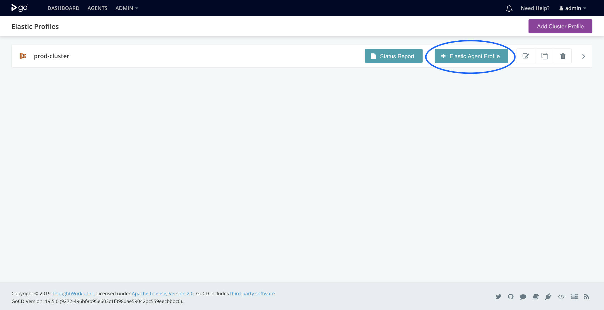
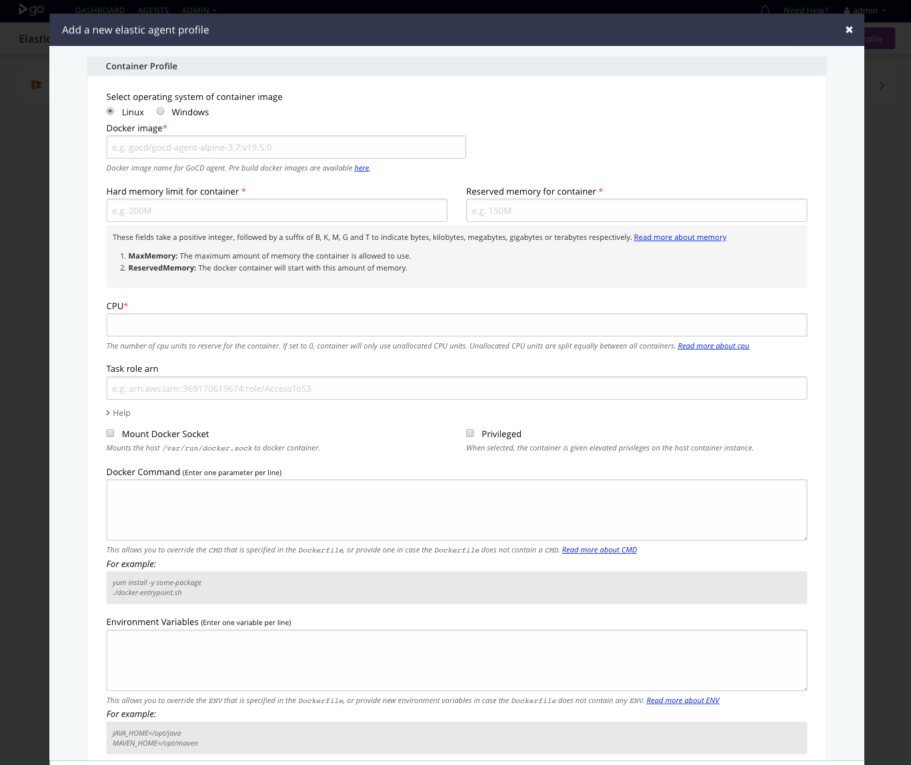
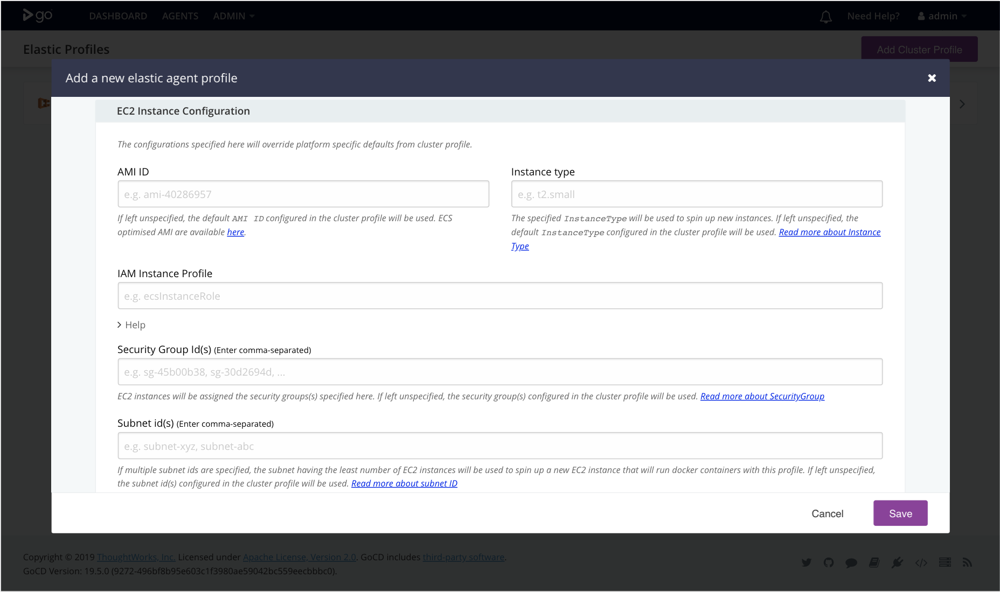

# Create an elastic agent profile for ECS

The elastic agent profile apart from having docker container configurations, provides an ability to configure an EC2 Instance. This would be useful in cases where a docker container cannot be created on the EC2 Instance provisioned using configurations provided in the cluster profile.

* Navigate to **_Admin > Elastic Profiles_** in the main menu
* Click the **_+ Elastic Agent Profile_** button to create a new elastic agent profile within the specified cluster.  


  
**_Note:_** *Configuration marked with (\*) are mandatory*

## Container configuration

Specify the properties for docker container(s) which will be used to spawn [ecs elastic agent](../gocd-elastic-agent-images/) for GoCD



1. **Profile ID:** Specify a unique id for this profile.

2. **Cluster Profile ID:** This will be auto populated as you are creating elastic agent profile within the cluster profile.

3. **Docker image\*:** [Docker image](elastic_agent_images.md) to spin up container. List of pre build docker images are available [here](https://www.gocd.org/download/#docker)

4. **Hard memory limit for container\*:** The maximum amount of memory that container is allowed to use. This field takes a positive integer, followed by a suffix of B, K, M, G and T to indicate bytes, kilobytes, megabytes, gigabytes or terabytes respectively. [Read more about memory](https://docs.docker.com/engine/admin/resource_constraints/#memory)

5. **Reserved memory for container\*:** The docker container will start with this amount of memory. This option is only available for `Linux` platform. This field takes a positive integer, followed by a suffix of B, K, M, G and T to indicate bytes, kilobytes, megabytes, gigabytes or terabytes respectively. [Read more about memory](https://docs.docker.com/config/containers/resource_constraints/). 

6. **CPU\*:** The number of cpu units to reserve for the container. A EC2 instance has 1,024 cpu units for every CPU core. This parameter specifies the minimum amount of CPU to reserve for a container. [Read more about CPU](https://docs.docker.com/engine/admin/resource_constraints/#cpu).
    - **Linux:** If set to 0, container will only use unallocated CPU units. Unallocated CPU units are split equally between all containers.
    - **Windows:** We recommend using at least **1024 CPU units (1 core)** for Windows. Allocating lesser CPU units(including 0) will result in very slow running container.
    
7. **Task role arn:** Name of the IAM role to associate with the agent container. This can have any permission that is required by the given job. At the bare minimum your role must permit action `sts:AssumeRole` and allow access to `ecs-tasks.amazonaws.com` service.
    > Bare minimum role template
      
      ```json
        {
          "Version": "2012-10-17",
          "Statement": [
            {
              "Sid": "",
              "Effect": "Allow",
              "Principal": {
                "Service": "ecs-tasks.amazonaws.com"
              },
              "Action": "sts:AssumeRole"
            }
          ]
        }
      ```    
8. **Mount Docker Socket:** Mounts the host `/var/run/docker.sock` to docker container

9. **Privileged:** When this parameter is true, the container is given elevated privileges on the host container instance. This is useful to run docker in docker workflow.

10. **Docker Command:** Specify the command to run in the container. Enter one parameter per line. This allows you to override the `CMD` that is specified in the `Dockerfile`, or provide one in case the `Dockerfile` does not contain a `CMD`. Read more about [CMD](https://docs.docker.com/engine/reference/builder/#cmd).

11. **Environment Variables:** Specify the environment variables. Enter one variable per line. This allows you to override the `ENV` that is specified in the `Dockerfile`, or provide new environment variables in case the `Dockerfile` does not contain any `ENV`. Read more about [ENV](https://docs.docker.com/engine/reference/builder/#env).
    - Environment variables are resolved in following order:
      1. **_Elastic Profile:_** This will override the variable value specified in `cluster profile` and `Dockerfile`.
      2. **_Plugin Settings:_** This will override the variable value specified in `Dockerfile`.
      3. **_Dockerfile:_** Variable defined in `Dockerfile` has low precedence over other two. For example, variable `Foo` defined in cluster profile or elastic profile will override the variable defined in `Dockerfile`.

12. **Bind Mount:** Use bind mounts to mount one or more file or directory from the host machine on to the container. The BindMount configuration requires the following configuration,
  - **_Name:_** Name of the volume.
  - **_SourcePath:_** The path from the host machine that needs to be mounted on the container.
  - **_ContainerPath:_** The path on the container to mount the volume at.

    > Example BindMount Configuration

       ```json
         [
           {
             "Name": "data",
             "SourcePath": "/ecs/data",
             "ContainerPath": "/var/data"
           }
         ]
       ``` 


## EC2 Instance Configuration

Specify the configuration for the EC2 instance. This is optional. If specified, then the docker container(s) will be spawned on the EC2 instance matching specified configuration. Otherwise, it will be spawned on EC2 instance created using the global configuration specified in `Plugin Settings`.



1. **AMI ID:** This AMI ID will be used to spin up EC2 instances that will run docker containers with this profile. If left unspecified, the default AMI ID configured in the cluster profile will be used to spin up an EC2 instance. Read more about [ECS optimized AMIs](https://docs.aws.amazon.com/AmazonECS/latest/developerguide/ecs-optimized_AMI.html) 
    - ECS optimized AMIs for -
        - [Linux](https://docs.aws.amazon.com/AmazonECS/latest/developerguide/launch_container_instance.html) 
        - [Windows](https://docs.aws.amazon.com/AmazonECS/latest/developerguide/ECS_Windows_getting_started.html#launch_windows_container_instance)

2. **Instance type:** This instance type will be used to spin up EC2 instances that will run docker containers with this profile. If left unspecified, the default instance type configured in the cluster profile will be used to spin up an EC2 instance. Read more about [Instance Type](http://docs.aws.amazon.com/AWSEC2/latest/UserGuide/instance-types.html)  

3. **IAM instance profile:** The name of the IAM profile that will allow the ECS agent to make calls to AWS on your behalf. Please refer [pre-requisites](../prerequisites/) for more information. If left unspecified, the `IAM Instance Profile` configured in the cluster profile will be used to spin up an EC2 instance. Read more about [IAM Instance Profile](http://docs.aws.amazon.com/AmazonECS/latest/developerguide/instance_IAM_role.html)              
  
4. **Subnet id(s):** Enter comma separated subnet ids. If multiple subnet ids are specified, the subnet having the least number of EC2 instances will be used to spin up a new EC2 instance. If left unspecified, the `Subnet id(s)` configured in the cluster profile will be used to spin up an EC2 instance. Read more about [VPCs & Subnets](https://docs.aws.amazon.com/vpc/latest/userguide/VPC_Subnets.html)  

5. **Security Group Id(s):**  Enter comma separated security group ids. EC2 instances will be assigned the security groups(s) specified here. If left unspecified, the `Security Group Id(s)` configured in the cluster profile will be used to spin up an EC2 instance. Read more about [SecurityGroup](https://docs.aws.amazon.com/vpc/latest/userguide/VPC_SecurityGroups.html)

6. **Spot Instance Configuration**
   - **Run As Spot Instance:** On selecting this option the plugin would run a docker container on a EC2 Spot Instance.
   - **Spot Price:** The maximum price per hour that you are willing to pay for the Spot Instance. If not provided defaults to `On-Demand` Price.
   - **Spot Request Expires After(in minutes):** The plugin supports Spot Instance of type `one-time`. SpotRequestExpiresAfter(in minutes) property is used to set the validity of the Spot Instance request from the time the request is created. Defaults to `5 mins`.

**Note:** Spot Instances can be terminated automatically. The plugin does not track Spot Instance interruption notices, on an instance termination all jobs running on the spot instance will be eventually re-scheduled.

7. Save your changes

**_Note:_** *Configuration marked with (\*) are mandatory*
