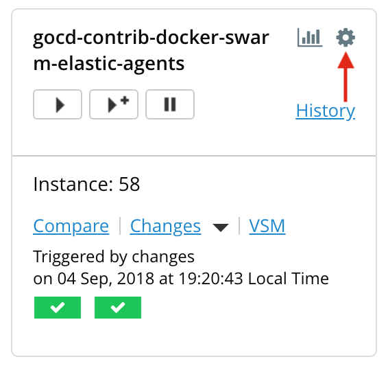
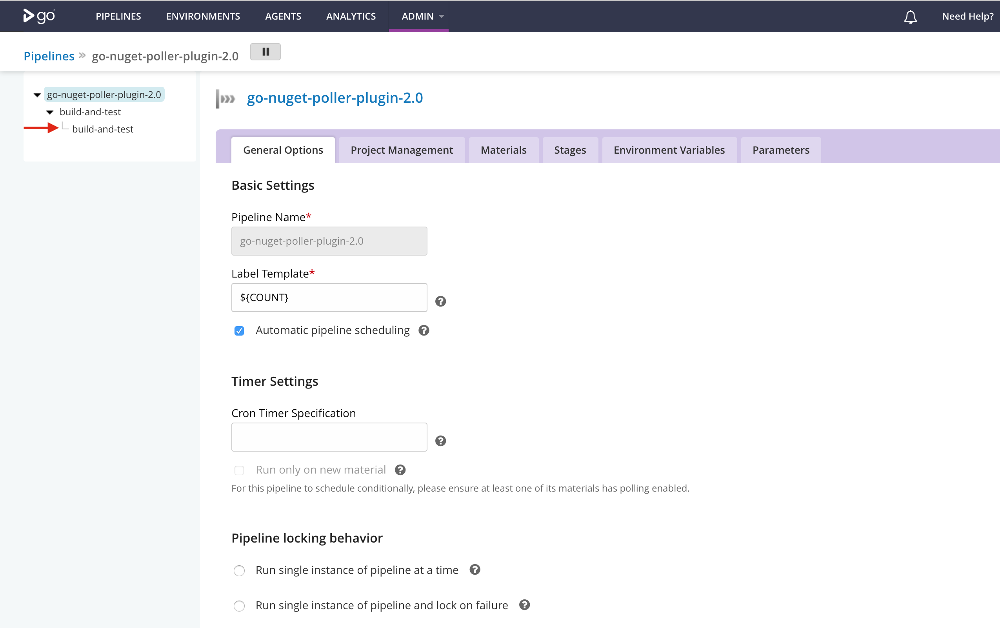
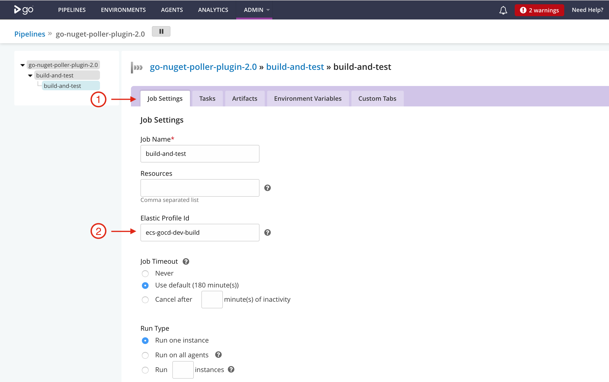

# Configure job to use an elastic agent profile

The Elastic Agent Profile is used to define the configuration of a docker container, it is used to configure the docker image, set memory limits, provide docker command and environment variables.

Following configuration ties your job with an Elastic Agent Profile, it effectively means that the plugin will run your job on newly created docker container using configuration defined in that elastic agent profile.  

### Steps to configure job to use ECS Elastic Agent: 

* Click the gear icon on **_Pipeline_**

    

* Navigate to job

    

* Click on **_Job Settings_**, and add profile id

    

* Save your changes
