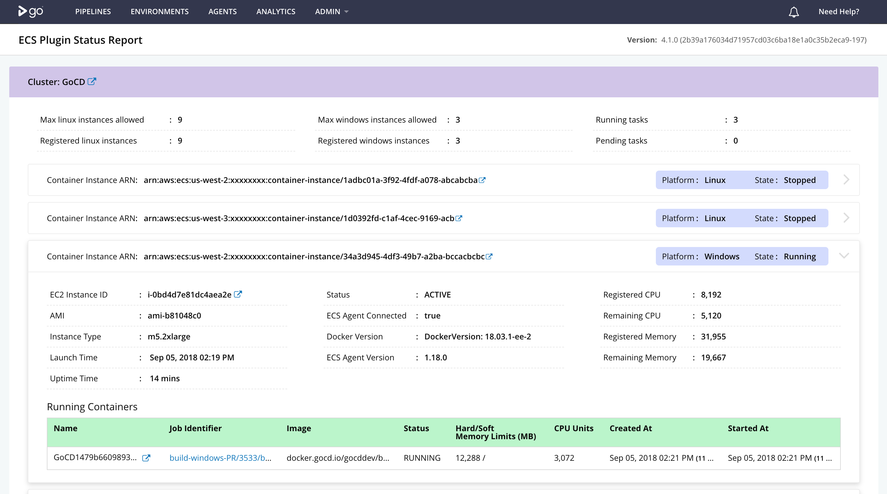
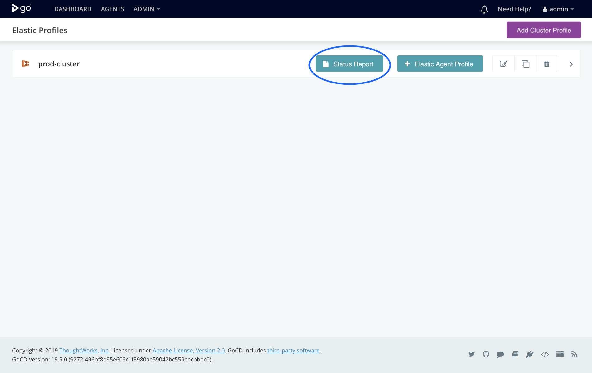
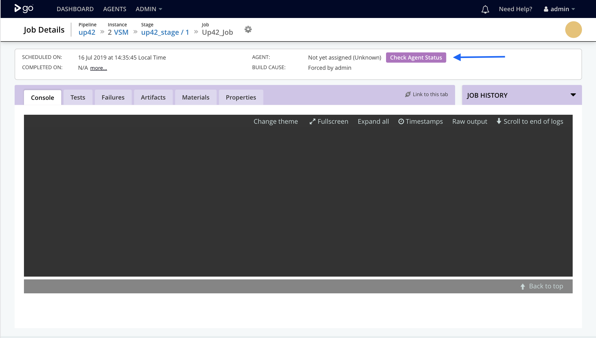

# GoCD - Amazon ECS Elastic Agent Plugin

## Status Report

The Cluster Status report gives a quick overview of the ECS cluster. The status report lists the ECS Container Instances and the corresponding running Containers on it. The report also lists the errors and warnings to quickly troubleshoot issues.
         


### Accessing the ECS Plugin **Status Report** (for admins only)
You can access the status report from two places -

1. **Directly from the elastic profiles page:**

    

2. **From the job details page:**

    
    
---

## Enable Logs

### If you are on GoCD version 19.6 and above:

Edit the file `wrapper-properties.conf` on your GoCD server and add the following options. The location of the `wrapper-properties.conf` can be found in the [installation documentation](https://docs.gocd.org/current/installation/installing_go_server.html) of the GoCD server.

 ```properties
# We recommend that you begin with the index `100` and increment the index for each system property
wrapper.java.additional.100=-Dplugin.com.thoughtworks.gocd.elastic-agent.ecs.log.level=debug
```

If you're running with GoCD server 19.6 and above on docker using one of the supported GoCD server images, set the environment variable `GOCD_SERVER_JVM_OPTIONS`:

 ```shell
docker run -e "GOCD_SERVER_JVM_OPTIONS=-Dplugin.com.thoughtworks.gocd.elastic-agent.ecs.log.level=debug" ...
```

---

### If you are on GoCD version 19.5 and lower:

* **On Linux:**

    Enabling debug level logging can help you troubleshoot an issue with this plugin. To enable debug level logs, edit the file `/etc/default/go-server` (for Linux) to add:

    ```shell
    export GO_SERVER_SYSTEM_PROPERTIES="$GO_SERVER_SYSTEM_PROPERTIES -Dplugin.com.thoughtworks.gocd.elastic-agent.ecs.log.level=debug"
    ```

    If you're running the server via `./server.sh` script:

    ```shell
    $ GO_SERVER_SYSTEM_PROPERTIES="-Dplugin.com.thoughtworks.gocd.elastic-agent.ecs.log.level=debug" ./server.sh
    ```

    The logs will be available under `/var/log/go-server`

* **On windows:**

    Edit the file `config/wrapper-properties.conf` inside the GoCD Server installation directory (typically `C:\Program Files\Go Server`):

    ```
    # config/wrapper-properties.conf
    # since the last "wrapper.java.additional" index is 15, we use the next available index.
    wrapper.java.additional.16=-Dplugin.com.thoughtworks.gocd.elastic-agent.ecs.log.level=debug
    ```

    The logs will be available under the `logs` folder in the GoCD server installation directory.

---

*  **Windows EC2 instance log locations**

    | Log                    | Dir                                                                |
    |:-----------------------|:-------------------------------------------------------------------|
    | ECS log                | C:\ProgramData\Amazon\ECS\log                                      |
    | Userdata execution log | C:\ProgramData\Amazon\EC2-Windows\Launch\Log\UserdataExecution.log |
    | Task history log       | C:\ProgramData\Amazon\ECS\log                                      |
